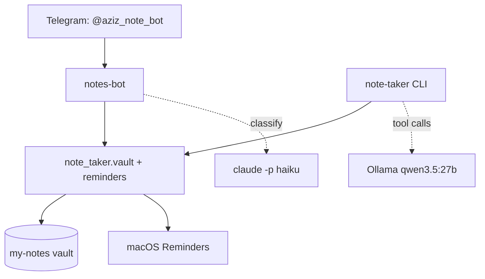

# Big Plan

How the pieces around this vault fit together, and what was built.

## The three parts

| Part | Where | Does |
|---|---|---|
| **notes-bot** | `~/projects/ml/notes-bot` | Telegram capture. Quick text, or `/new` guided flow |
| **note-taker** | `~/projects/ml/note-taker` | Ollama tool-calling agent + the shared vault library |
| **my-notes** | here | The vault itself |

## Why a shared library

Both the bot and the agent write notes. Frontmatter, heading insertion,
wikilink resolution and the Reminders wrapper live once in
`note_taker.vault` and `note_taker.reminders`, and the bot imports them. A
fix lands in both at the same time instead of drifting.

## Two brains, on purpose

- **notes-bot classifies with `claude -p --model haiku`** — about 10 seconds
  and a fraction of a cent per message. Fast enough to answer a Telegram
  message while you wait.
- **note-taker reasons with local `qwen3.5:27b`** — free and private, but 17GB
  and slow to load. Fine for a CLI you drive by hand; deliberately kept out of
  the Telegram request path.

## What the agent can do

Read: `list_vaults`, `list_notes`, `read_note`, `search_vault`.
Write: `create_note`, `append_note`, `add_note`, `add_plan_item`,
`create_reminder`, `capture_to_daily`, `archive_note`.

> [!important] There is no delete tool
> This vault's rule is that a note is never deleted, only moved to
> `archive/`. Rather than refuse deletion at runtime, the capability simply
> does not exist. `--read-only` mode works the same way — the write schemas
> are never sent, so the model genuinely has four functions.

## Conventions the agent follows

The system prompt carries the rules from [[CLAUDE]]: frontmatter on every
note, `[[Wikilinks]]` rather than paths, Title Case filenames, many small
notes over one long one, indexes named `MOC — Topic`, and never touching
`.obsidian/` or `notes/engineering-brain/`.

## Vaults

Notes live in `vaults/<name>/`. Currently `business`, `note` and `work`, each
with a `plan.md`. The bot's `/vaults` command and the agent's `list_vaults`
tool both read this directory, so creating a folder is all it takes to add one.

## Known rough edges

- `qwen3.5:27b` cold start is 1–3 minutes.
- Ollama has no LaunchAgent, so it must be started by hand (`ollama serve`);
  the agent fails with a clear message rather than a stack trace when it isn't.
- The bot's conversation state is in memory — a restart mid-`/new` loses the
  flow.
- Daily notes are named `YYYY-MM-DD.md`, which breaks the "no dates in
  filenames" convention. Unavoidable for daily notes.

## See also

- [[Start Here]] — the vault's own introduction
- [[Example]] — syntax demo
