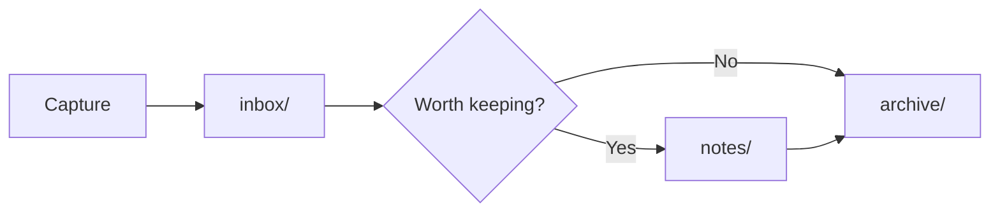

# Example

A first note, mostly to prove the vault works. The diagram below is how a note
moves through this vault.

> [!note] Mermaid renders in reading view
> In edit mode you see the code fence; switch to reading view (`Cmd+E`) to see
> the actual diagram.
a

